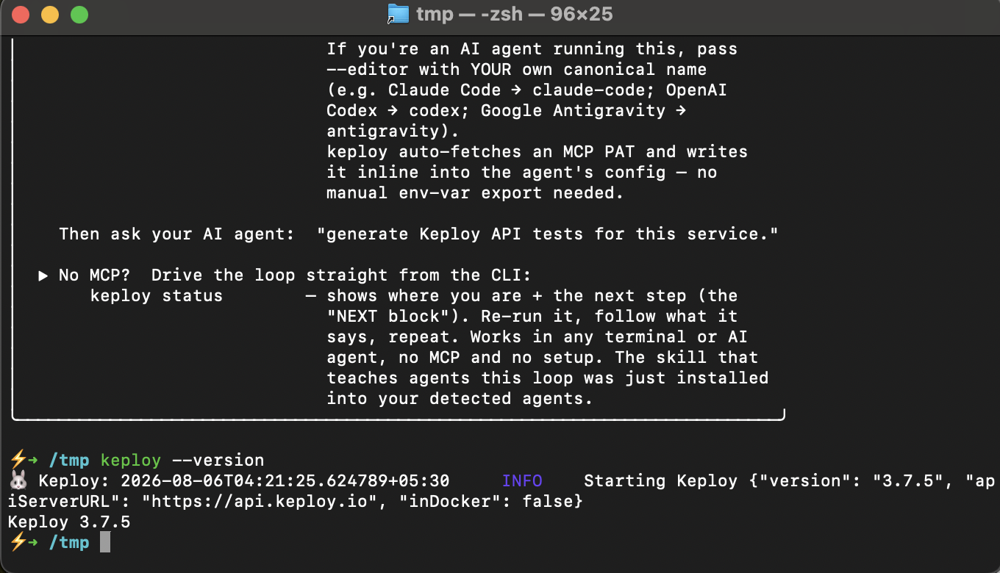

# Testing a Go API Without Writing Tests — a Keploy walkthrough

A single-page documentation site built with **Next.js** and **MDX**, containing an original,
beginner-focused tutorial on running the [Keploy](https://keploy.io) **Mux + MySQL** Go quickstart.

The tutorial is not a rewrite of Keploy's docs. It's a write-up of an actual run: every command,
every log line, and every test summary on the page was produced on the machine described at the
bottom of the article — including the things that went wrong and how they were fixed.

## The Keploy CLI



The CLI installs and runs natively on macOS — `keploy --version`, `keploy login` and
`keploy status` all work there. What *doesn't* work natively is `record` and `test`:
the traffic interception is eBPF-based, so it needs a Linux kernel underneath. That's
the reason the walkthrough runs inside a Colima VM.

## What the tutorial covers

- Why `record` and `test` need a Linux kernel, and how to get one with Colima
- The OSS vs Community Edition split, and which Go quickstarts each one can actually run
- `keploy record` — turning six `curl` calls into 7 test cases and 9 MySQL mocks
- `keploy test` — replaying all 7 **with the MySQL container stopped**
- Four deliberate regressions, to find what Keploy's diffing does and does not catch

## Stack

| | |
|---|---|
| Framework | Next.js 16 (App Router, Turbopack) |
| Content | MDX via `@next/mdx` — the page *is* `app/page.mdx` |
| UI | shadcn/ui (Base UI primitives) + Tailwind CSS v4 |
| Syntax highlighting | `rehype-pretty-code` + Shiki, dual light/dark themes |
| Theming | `next-themes`, class-based dark mode with a header toggle |
| Fonts | Geist Sans / Geist Mono |

## Structure

```
app/
  page.mdx           the tutorial — all content lives here
  layout.tsx         shell: header, sidebar TOC, theme provider, footer
  globals.css        shadcn tokens + Shiki dual-theme wiring
components/
  callout.tsx        <Callout type="info|warn|success|danger"> used throughout the MDX
  stats.tsx          headline figures at the top of the article
  toc.tsx            table of contents, built from rendered headings at runtime
  theme-toggle.tsx   light/dark switch
  site-header.tsx    sticky header
  ui/                shadcn components
mdx-components.tsx   maps every markdown element to a styled component
```

Markdown tables render through shadcn's `Table`; fenced code blocks get a language badge and
horizontal scroll; the sidebar TOC reads the rendered `h2`s so the MDX stays the only source of
truth for the outline.

## Run locally

```bash
npm install
npm run dev
```

Then open http://localhost:3000.

```bash
npm run build && npm start   # production build
```
